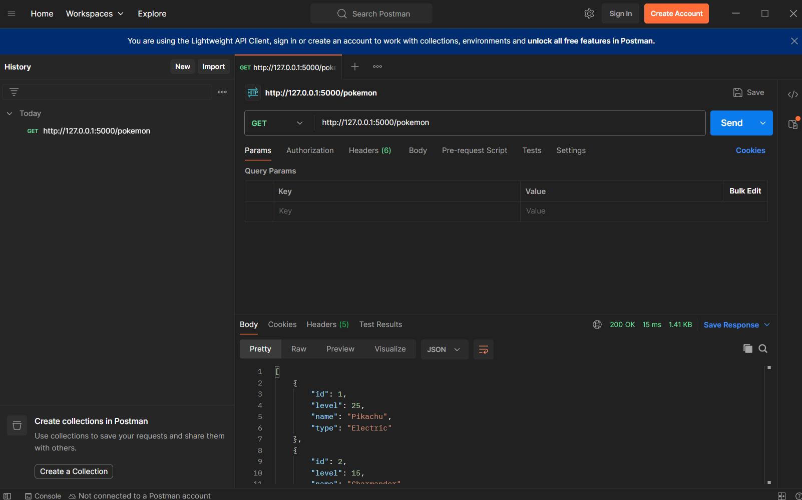
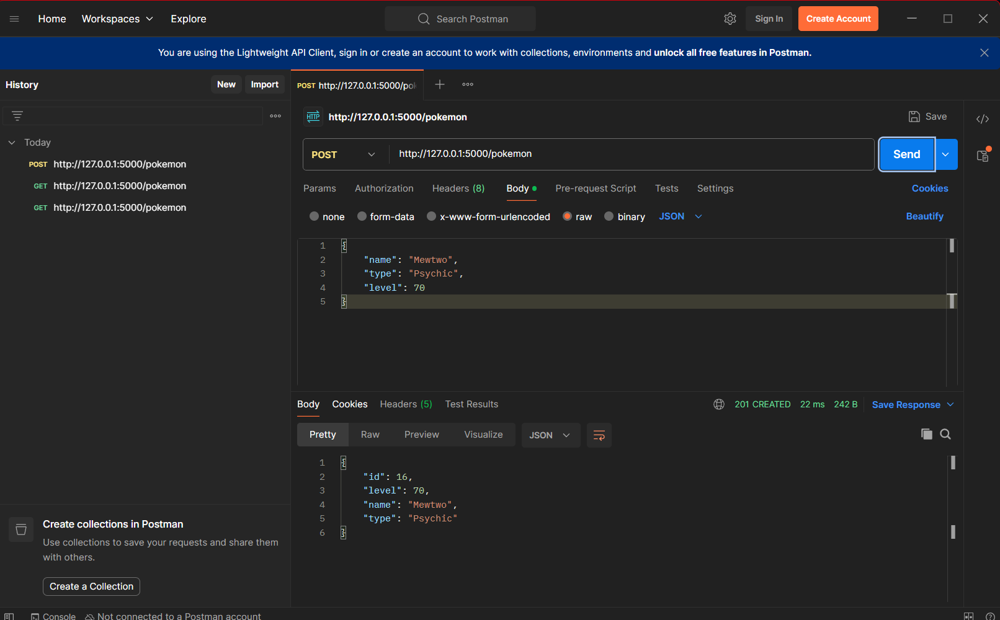
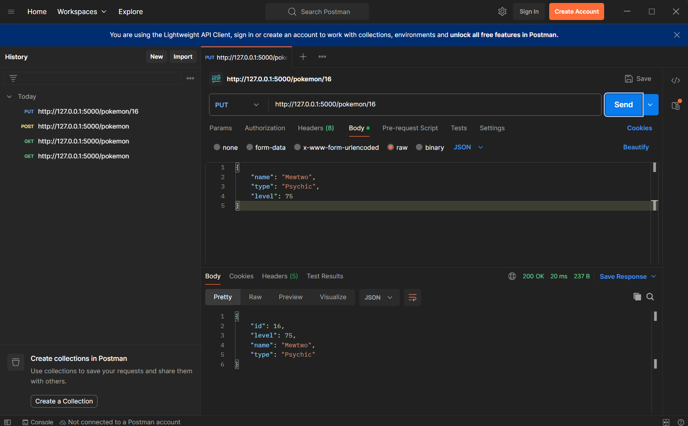
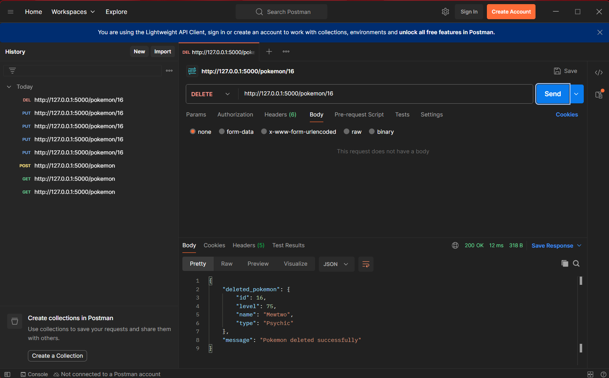

# Pokemon Full Stack CRUD App

A full stack Pokemon manager built with **Python, Flask, SQLite, HTML5, CSS3, and JavaScript Fetch API**.

This repository contains the original REST API backend plus a browser frontend that can **list, view, add, edit, and delete Pokemon** through a real user interface.

## Frontend for Your API Server Lab

This project fulfills the lab requirement to build a frontend that consumes the API server from the previous activity. The frontend is inside the existing repository under the `frontend/` folder.

### Assignment Requirement Checklist

- [x] Frontend folder inside the existing API repository
- [x] List view using `GET /pokemon`
- [x] Detail view using `GET /pokemon/:id`
- [x] Add form using `POST /pokemon`
- [x] Edit form using `PUT /pokemon/:id`
- [x] Delete button using `DELETE /pokemon/:id`
- [x] Displays API validation messages for HTTP `400`
- [x] Handles HTTP `404` gracefully
- [x] Shows a loading state while fetching data
- [x] Styled responsive user interface
- [x] README includes steps to run both backend and frontend
- [ ] Walkthrough video — recorded and submitted separately by the student

## Features

### Backend API

- Retrieve all Pokemon
- Retrieve a single Pokemon by ID
- Create new Pokemon
- Update existing Pokemon
- Delete Pokemon
- Validate required fields
- Return appropriate HTTP status codes
- Store data in SQLite
- Seed the database with starter Pokemon

### Frontend

- Pokemon collection/list view
- Pokemon detail view
- Add Pokemon form
- Edit Pokemon form
- Delete confirmation
- Success and error messages
- API validation error display
- Friendly 404 handling
- Loading indicator
- Responsive layout for desktop and mobile
- Pokemon artwork in the detail view using **PokeAPI** when internet access is available

The artwork feature is an extra visual enhancement. The CRUD application still works if PokeAPI is unavailable; in that case the detail view shows an artwork placeholder.

## Project Structure

```text
pokemon-api-server/
├── app.py
├── pokemon.db
├── requirements.txt
├── README.md
├── frontend/
│   ├── index.html
│   ├── styles.css
│   └── app.js
└── screenshots/
    ├── GET.png
    ├── POST.png
    ├── PUT.png
    └── DELETE.png
```

## How the Frontend Connects to the Backend

Flask serves both the API and the frontend files from the same application and same origin.

The main application runs at:

```text
http://127.0.0.1:5000
```

The frontend calls API routes such as:

```text
/pokemon
/pokemon/1
```

Because the frontend and API share the same origin, a separate CORS package is not required for this version of the project.

## How to Run the Project

### 1. Clone the repository

Final repository:

```bash
git clone https://github.com/AndreiJullian/pokemon-api-server.git
cd pokemon-api-server
```

### 2. Install the Python dependency

On Windows, if the `py` command is available:

```powershell
py -m pip install -r requirements.txt
```

Or, on systems where `python` is the command:

```bash
python -m pip install -r requirements.txt
```

### 3. Start the Flask backend

Windows:

```powershell
py app.py
```

Alternative:

```bash
python app.py
```

The terminal should show something similar to:

```text
Running on http://127.0.0.1:5000
```

Keep that terminal open while using the application.

### 4. Open the frontend

Open a browser and visit:

```text
http://127.0.0.1:5000
```

The frontend is served automatically by Flask. **No second frontend server is required.**

## Pokemon Data Structure

Each local Pokemon record contains:

```json
{
  "id": 1,
  "name": "Pikachu",
  "type": "Electric",
  "level": 25
}
```

## REST API Endpoints

| Method | Endpoint | Purpose | Success Status |
|---|---|---|---|
| GET | `/pokemon` | Retrieve all Pokemon | `200 OK` |
| GET | `/pokemon/:id` | Retrieve one Pokemon | `200 OK` |
| POST | `/pokemon` | Create a Pokemon | `201 CREATED` |
| PUT | `/pokemon/:id` | Update a Pokemon | `200 OK` |
| DELETE | `/pokemon/:id` | Delete a Pokemon | `200 OK` |

## GET All Pokemon

```text
GET /pokemon
```

Example response:

```json
[
  {
    "id": 1,
    "name": "Pikachu",
    "type": "Electric",
    "level": 25
  }
]
```

## GET Pokemon by ID

```text
GET /pokemon/1
```

Example response:

```json
{
  "id": 1,
  "name": "Pikachu",
  "type": "Electric",
  "level": 25
}
```

## POST Create Pokemon

```text
POST /pokemon
```

Example JSON request:

```json
{
  "name": "Mewtwo",
  "type": "Psychic",
  "level": 70
}
```

## PUT Update Pokemon

```text
PUT /pokemon/16
```

Example JSON request:

```json
{
  "name": "Mewtwo",
  "type": "Psychic",
  "level": 75
}
```

## DELETE Pokemon

```text
DELETE /pokemon/16
```

A successful delete returns a confirmation message and the deleted Pokemon data.

## Validation and Error Handling

POST and PUT require all of the following fields:

- `name`
- `type`
- `level`

If a required field is missing, the backend returns HTTP `400` with a message such as:

```json
{
  "error": "name, type, and level are required"
}
```

The frontend displays that API message instead of failing silently.

If a Pokemon ID does not exist, the backend returns HTTP `404`:

```json
{
  "error": "Pokemon not found"
}
```

The frontend shows a friendly 404 state instead of a blank screen.

## Loading State

While the frontend is waiting for `GET /pokemon`, it displays a loading spinner and the text:

```text
Loading Pokemon...
```

## Fetch API Example

The frontend uses a reusable helper in `frontend/app.js`:

```javascript
async function apiRequest(url, options = {}) {
  const response = await fetch(url, options);
  // response handling follows here
}
```

For example, the list view uses:

```javascript
const items = await apiRequest('/pokemon');
```

This sends a GET request from the browser frontend to the Flask API and then renders the returned JSON data.

## Pokemon Artwork

When **View** is clicked, the app first loads the selected record from the local Flask API with `GET /pokemon/:id`. It then uses the Pokemon name to request artwork from:

```text
https://pokeapi.co/api/v2/pokemon/{pokemon-name}
```

No PokeAPI key is required. Internet access is required only for this artwork lookup. If the lookup fails or the entered name is not a recognized Pokemon, the normal local details still display with a placeholder image area.

## Walkthrough Video Checklist

The walkthrough should be **no more than 5 minutes** and should show the following in order:

1. The Flask backend running in the terminal
2. The list view loading Pokemon data
3. Adding a new Pokemon through the frontend form
4. Editing a Pokemon
5. Deleting a Pokemon
6. Deliberately triggering a validation error by leaving a required field empty and showing the API error in the UI
7. A quick look at one `fetch()` call in `frontend/app.js` with a short explanation of what it does

### Recording Safety

Do not show:

- API keys
- passwords or tokens
- an open `.env` file
- database connection strings containing secrets

Set the final video sharing permission so the instructor can open it with the submitted link.

## What to Submit

Submit these two links as a single text entry in Canvas:

1. The **public GitHub repository link** containing the frontend folder and updated README
2. The **walkthrough video link**

A hosted/deployed website link is **not required** for this lab. The application can run locally.

## API Testing Screenshots

The original backend activity screenshots remain in the repository.

### GET - Retrieve All Pokemon



### POST - Create a Pokemon



### PUT - Update a Pokemon



### DELETE - Delete a Pokemon



## Technologies Used

- Python 3
- Flask
- SQLite
- HTML5
- CSS3
- JavaScript
- Fetch API
- PokeAPI for optional Pokemon artwork
- Postman for backend API testing

## Author

**Andrei Nacaya**

## Project

**Build Your Own API Server Challenge + Frontend for Your API Server Lab**
